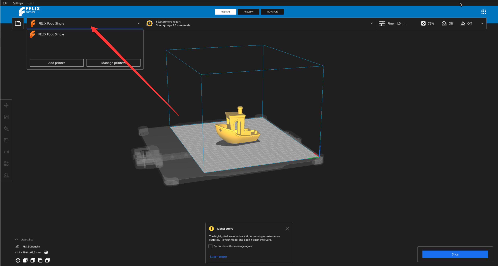
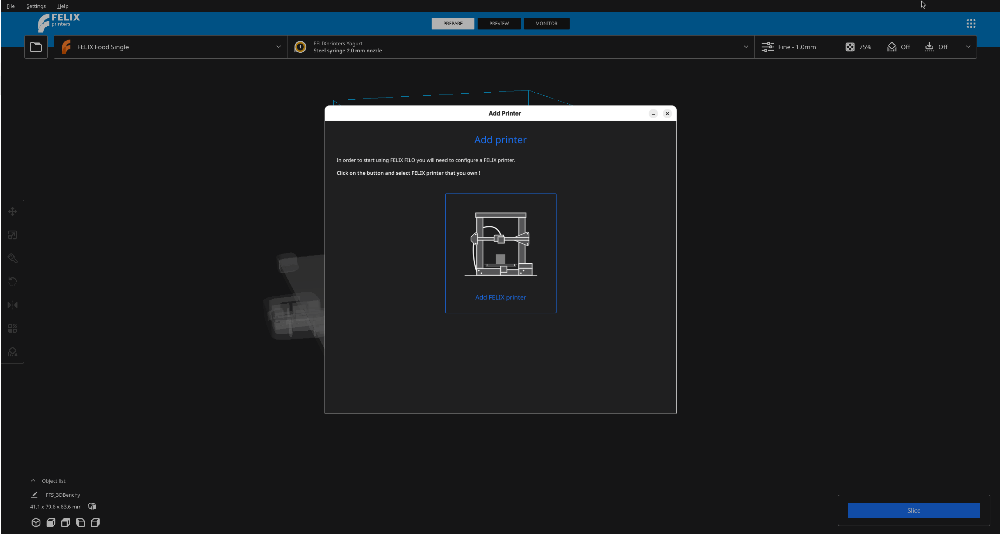
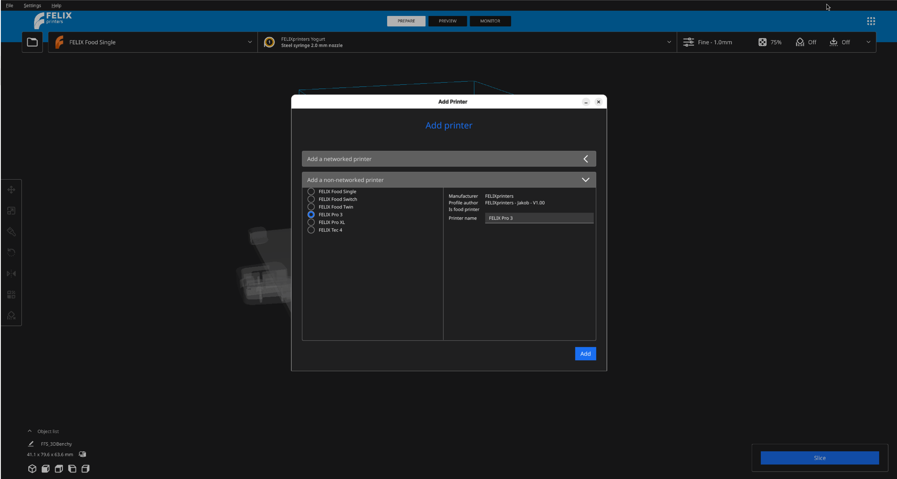
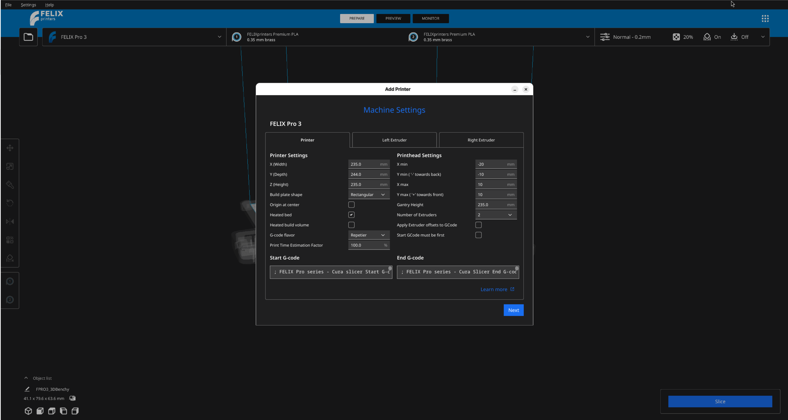
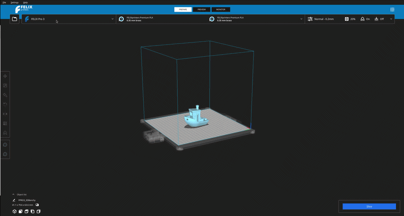

# Adding more printers

In FELIX-FILO you can slice your model with configuration for different printers without any problem.

Firstly, click on the printer name on the top left the application. This will expand, showing you with more options.

<figure markdown="span">
  { width="600" }
  
<figcaption>Roll down menu with more options</figcaption>
</figure>

Now we select `Add printers` which will present us with the same dialogue as during hte welcome step.

<figure markdown="span">
  { width="600" }
  
<figcaption>Select FELIX Printer</figcaption>
</figure>

Select `Add FELIX Printer`.

As a next step we have to again choose if we want to add printer from the network or one that is preconfigured in the application.

<figure markdown="span">
  { width="600" }
  
<figcaption>Overview of configuring various printers</figcaption>
</figure>

You are going to be interacting with the list `Add a non-networked printer`. In order to do that click on it. This should show you the list with various printers to choose from.

Depending on the printer you want to add select it. Make sure that you do not select a printer which is already loaded in the application ! If you accidentally do so, no worries, nothing will happen and you will have to repeat those steps again.

!!! Note

    For troubleshooting purposes we advise you to keep the name as it is.

Once the printer is selected press `Add` after which you are going to be presented with a list of options.

<figure markdown="span">
  { width="600" }
  
<figcaption>Configuration of the printer`s options</figcaption>
</figure>

We advise you to not change anything and continue with again pressing `Add`.

Now you should be redirected back to the main viewport of the application where you can notice that the name of the printer on the top left list has changed to the one you have just added.

## Changing the currently selected printer

Simply click again on the top left menu and select a printer you would like to use.

!!! note

    in order to do this you had to add the printer into the application through clicking `Add printer`

<figure markdown="span">
  { width="600" }
  
<figcaption>Overview of configuring various printers</figcaption>
</figure>

??? question "How do I add a new printer to FELIX-FILO?"

    Click on the printer name in the top left corner of the application to expand the menu, then select **Add printers**. Choose **Add FELIX Printer**, and pick whether it's a networked or non-networked printer.

??? question "Where do I find the list of available printers to add?"

    After selecting **Add FELIX Printer**, click on **Add a non-networked printer**. This will show you a list of printers to choose from.

??? question "I accidentally selected the printer that's already loaded in the application — did I break anything?"

    No, nothing will happen. Simply repeat the steps and select the correct printer this time.

??? question "Should I rename the printer when adding it?"

    We advise keeping the default name as it is, since this makes troubleshooting easier later on.

??? question "After selecting my printer and pressing Add, I see a list of options — should I change any of them?"

    No, we advise leaving the default options unchanged. Simply press **Add** again to continue.

??? question "How do I know the new printer was added successfully?"

    You'll be redirected to the main viewport, and the printer name in the top left menu will have changed to the one you just added.

??? question "How do I switch between printers I've already added?"

    Click on the top left menu and select the printer you want to use from the list.

??? question "Can I switch to a printer that I haven't added yet?"

    No, you first need to add the printer to the application using **Add printer** before it becomes available for selection.
