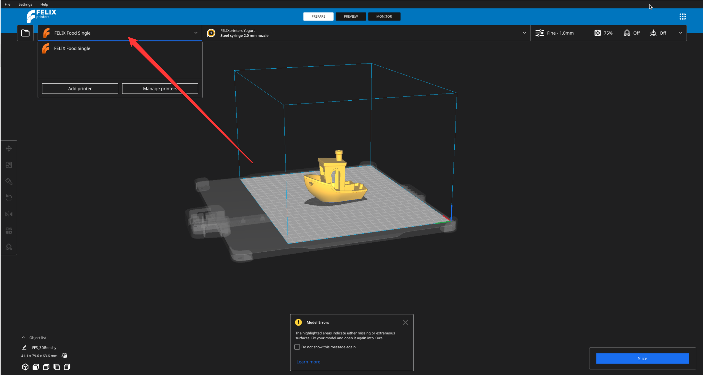
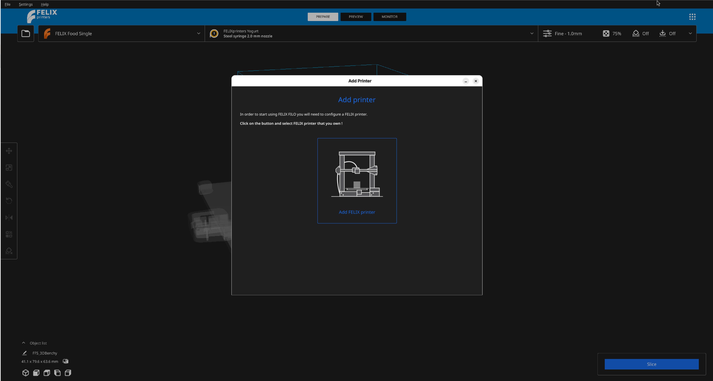
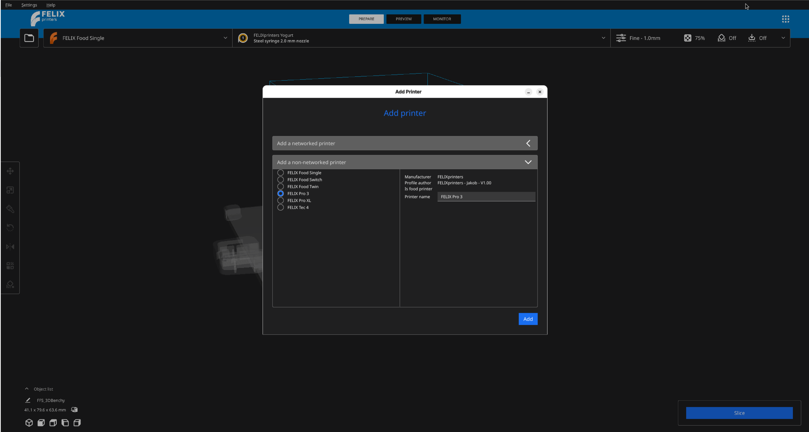
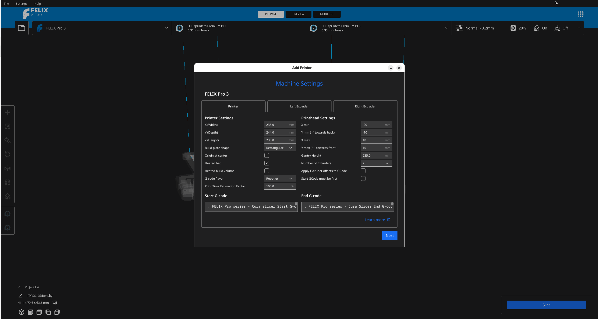
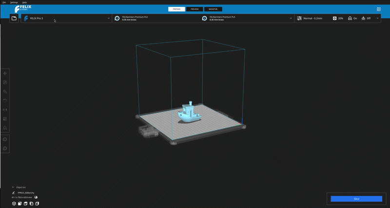

# Meer printers toevoegen

In FELIX-FILO kunt u uw model probleemloos slicen met configuraties voor verschillende printers.

Klik eerst op de printernaam linksboven in de applicatie. Hierdoor wordt het menu uitgeklapt en worden er meer opties getoond.

<figure markdown="span">
  { width="600" }
  
<figcaption>Uitklapmenu met meer opties</figcaption>
</figure>

Selecteer nu `Add printers`, waarna dezelfde dialoog wordt getoond als tijdens de welkomststap.

<figure markdown="span">
  { width="600" }
  
<figcaption>Selecteer FELIX-printer</figcaption>
</figure>

Selecteer `Add FELIX Printer`.

Vervolgens moet u opnieuw kiezen of u een printer via het netwerk wilt toevoegen, of een printer die al voorgeconfigureerd is in de applicatie.

<figure markdown="span">
  { width="600" }
  
<figcaption>Overzicht van het configureren van verschillende printers</figcaption>
</figure>

U gaat werken met de lijst `Add a non-networked printer`. Klik hierop om de lijst met verschillende printers te openen.

Selecteer de printer die u wilt toevoegen, afhankelijk van uw keuze. Zorg ervoor dat u geen printer selecteert die al in de applicatie is geladen! Doet u dit toch per ongeluk, geen probleem: er gebeurt niets en u kunt de stappen gewoon opnieuw doorlopen.

!!! Note

    Voor troubleshooting-doeleinden raden wij aan de naam ongewijzigd te laten.

Zodra de printer is geselecteerd, klikt u op `Add`, waarna een lijst met opties wordt weergegeven.

<figure markdown="span">
  { width="600" }
  
<figcaption>Configuratie van de printeropties</figcaption>
</figure>

Wij raden aan om niets te wijzigen en verder te gaan door opnieuw op `Add` te klikken.

U wordt nu teruggeleid naar het hoofdvenster van de applicatie, waar u kunt zien dat de naam van de printer linksboven in de lijst is veranderd in de printer die u net heeft toegevoegd.

## De momenteel geselecteerde printer wijzigen

Klik opnieuw op het menu linksboven en selecteer de printer die u wilt gebruiken.

!!! note

    om dit te kunnen doen, moet u de printer eerst hebben toegevoegd via `Add printer`

<figure markdown="span">
  { width="600" }
  
<figcaption>Overzicht van het configureren van verschillende printers</figcaption>
</figure>

??? question "Hoe voeg ik een nieuwe printer toe aan FELIX-FILO?"

    Klik op de printernaam linksboven in de applicatie om het menu uit te klappen en selecteer vervolgens **Add printers**. Kies **Add FELIX Printer** en geef aan of het om een genetwerkte of niet-genetwerkte printer gaat.

??? question "Waar vind ik de lijst met beschikbare printers om toe te voegen?"

    Na het selecteren van **Add FELIX Printer** klikt u op **Add a non-networked printer**. Hierdoor wordt een lijst met printers getoond waaruit u kunt kiezen.

??? question "Ik heb per ongeluk de printer geselecteerd die al in de applicatie is geladen — heb ik iets beschadigd?"

    Nee, er gebeurt niets. Herhaal gewoon de stappen en selecteer deze keer de juiste printer.

??? question "Moet ik de printer een andere naam geven tijdens het toevoegen?"

    Wij raden aan de standaardnaam ongewijzigd te laten, omdat dit troubleshooting op een later moment vereenvoudigt.

??? question "Na het selecteren van mijn printer en het klikken op Add zie ik een lijst met opties — moet ik hier iets wijzigen?"

    Nee, wij raden aan de standaardopties ongewijzigd te laten. Klik gewoon opnieuw op **Add** om verder te gaan.

??? question "Hoe weet ik of de nieuwe printer succesvol is toegevoegd?"

    U wordt teruggeleid naar het hoofdvenster en de printernaam in het menu linksboven zal zijn veranderd in de printer die u net heeft toegevoegd.

??? question "Hoe wissel ik tussen printers die ik al heb toegevoegd?"

    Klik op het menu linksboven en selecteer de printer die u wilt gebruiken uit de lijst.

??? question "Kan ik overschakelen naar een printer die ik nog niet heb toegevoegd?"

    Nee, u moet de printer eerst toevoegen aan de applicatie via **Add printer** voordat deze beschikbaar wordt voor selectie.
