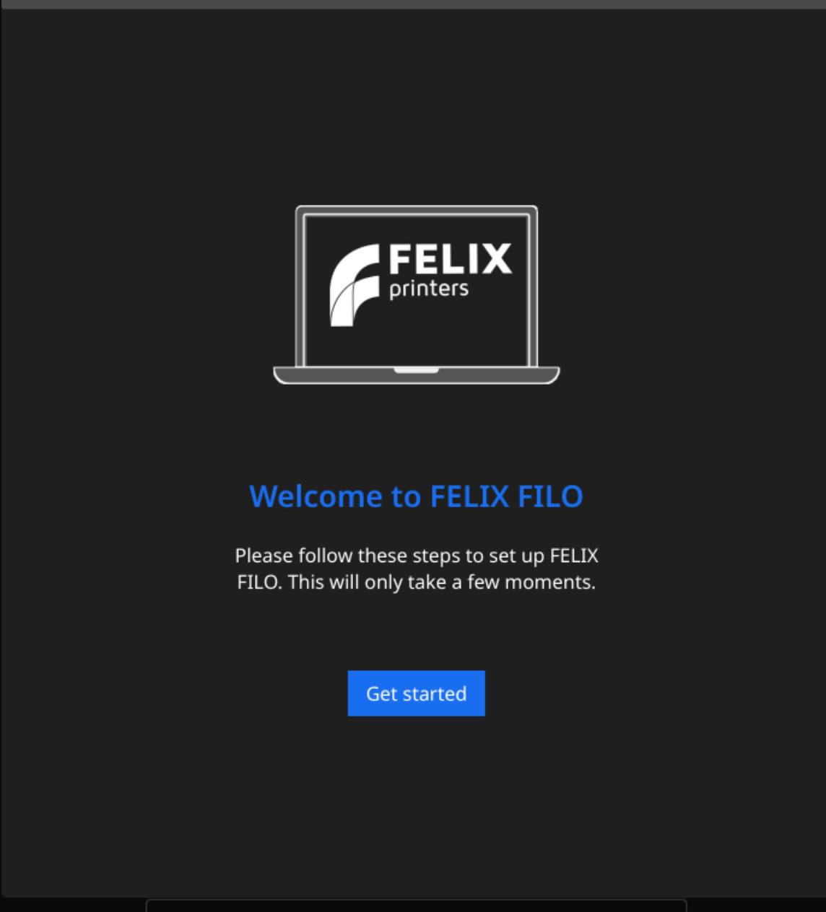
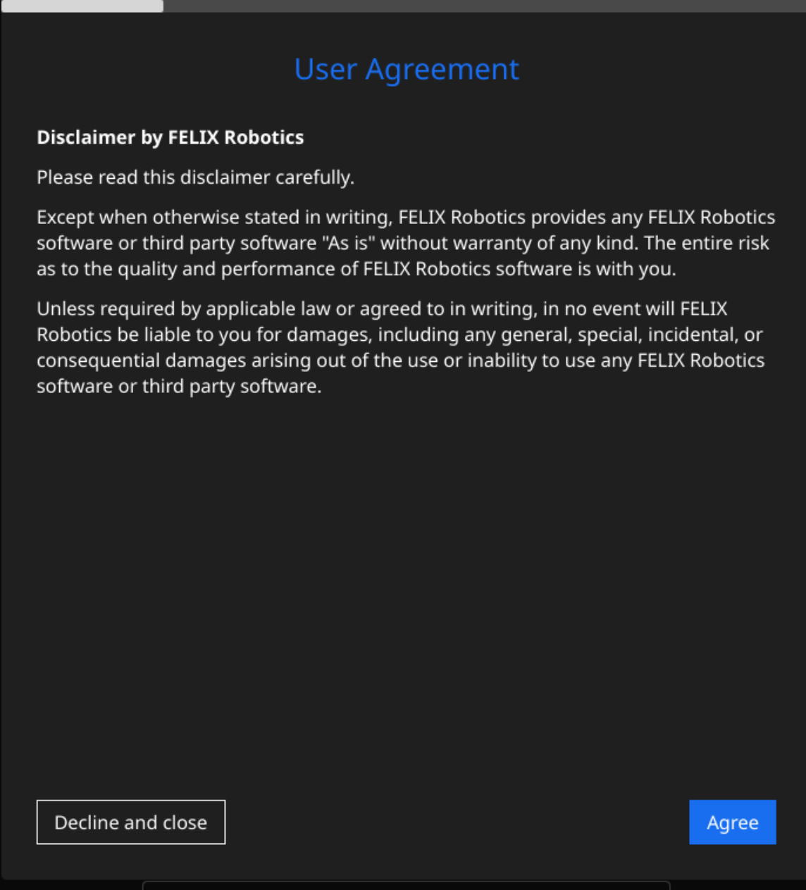
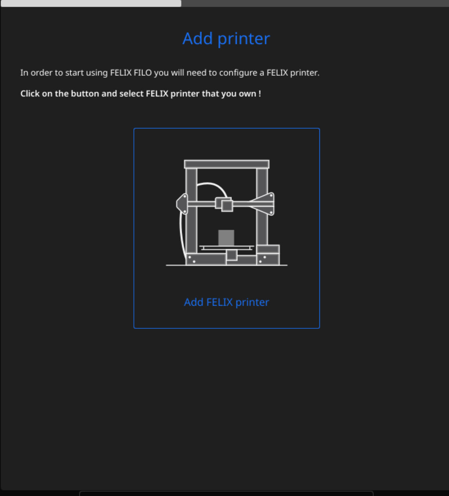
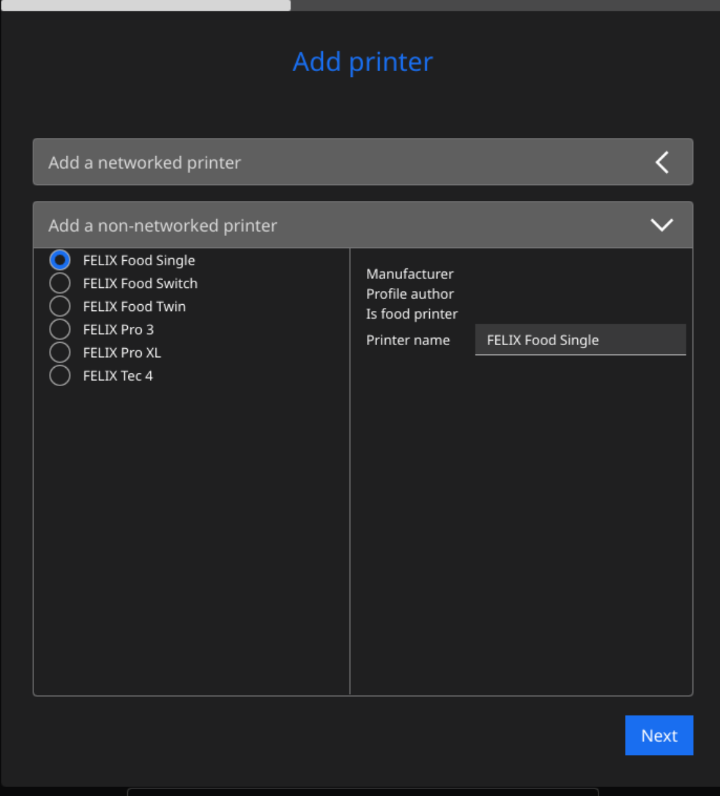
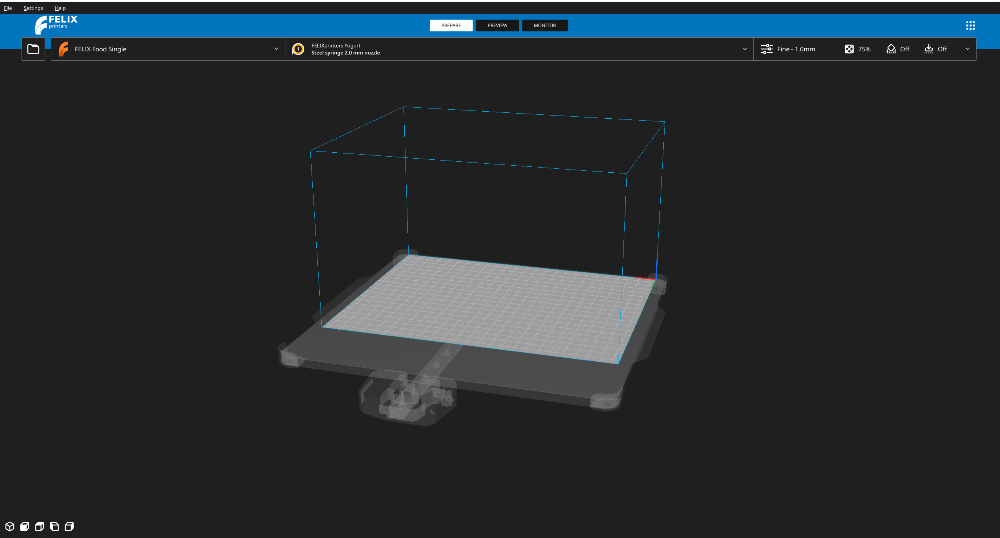

# Aan de slag

Deze pagina geeft u informatie over hoe u de welkomstwizard van FELIX-FILO kunt voltooien

## De welkomstwizard voltooien

Wanneer u de applicatie voor het eerst opent, krijgt u het initiële configuratiescherm te zien dat er als volgt uitziet

<figure markdown="span">
  { width="300" }
<figcaption>Eerste welkomstpagina van de applicatie</figcaption>
</figure>

!!! note

    Dit welkomstvenster is alleen beschikbaar in het Engels omdat de taal nog niet is geconfigureerd. Als u het welkomstdialoogvenster in andere talen wilt bekijken, wijzig dan de taal in deze documentatie.

Nadat u op `Get started` heeft gedrukt, wordt u doorgestuurd naar het accepteren van de gebruikersovereenkomsten. Druk op `Agree` om verder te gaan.

!!! warning

    Als u niet akkoord gaat met onze gebruikersovereenkomsten, neem dan contact met ons op.

<figure markdown="span">
  { width="300" }
<figcaption>Gebruikersovereenkomst van de applicatie accepteren</figcaption>
</figure>

Als volgende stap moet u een printer selecteren die u bezit en waarvoor u het programma wilt configureren.

Selecteer `Add FELIX Printer`.

<figure markdown="span">
  { width="300" }
<figcaption>FELIX-printer selecteren</figcaption>
</figure>

Als u alles correct heeft gedaan, ziet u een venster waarin u wordt gevraagd om te kiezen tussen een netwerkprinter of een niet-netwerkprinter.

<figure markdown="span">
  { width="400" }
<figcaption>Overzicht van het configureren van verschillende printers</figcaption>
</figure>

U gaat werken met de lijst `Add a non-networked printer`. Klik hierop om dit te doen. Hierdoor verschijnt een lijst met verschillende printers om uit te kiezen.

Selecteer, afhankelijk van de printer die u gebruikt, deze uit de lijst en geef deze eventueel een naam.

!!! Note

    Voor troubleshootingdoeleinden raden wij aan om de naam ongewijzigd te laten.

Zodra de printer is geselecteerd, drukt u op `Next`, waarna u een lijst met opties te zien krijgt. Wij raden aan om niets te wijzigen en verder te gaan door nogmaals op `Next` te drukken.

Hierna zou u in de hoofdweergave van de applicatie terecht moeten komen

<figure markdown="span">
  { width="800" }
<figcaption>Hoofdweergave van de applicatie</figcaption>
</figure>
