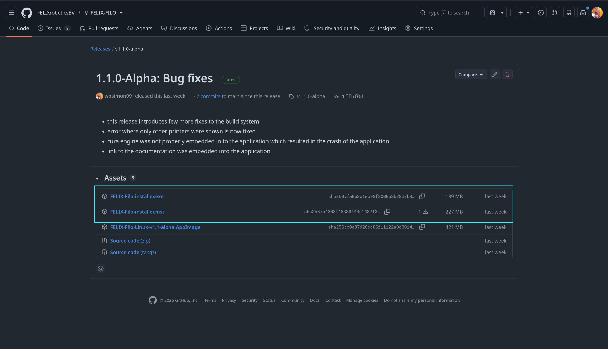
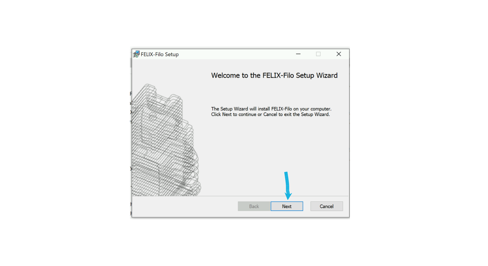
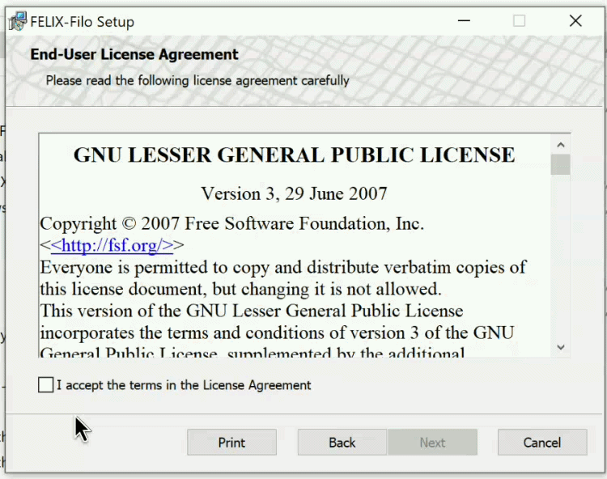
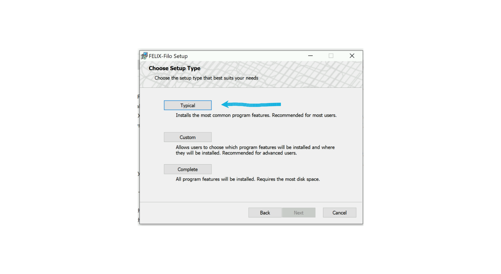
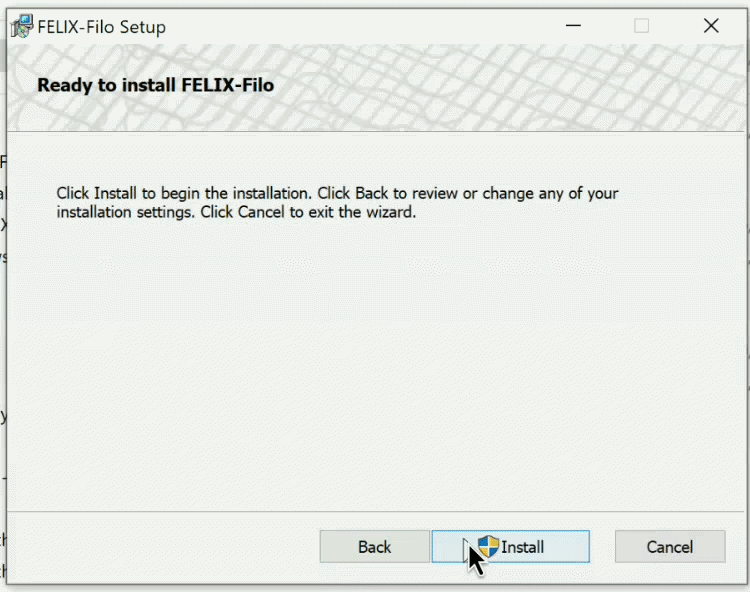
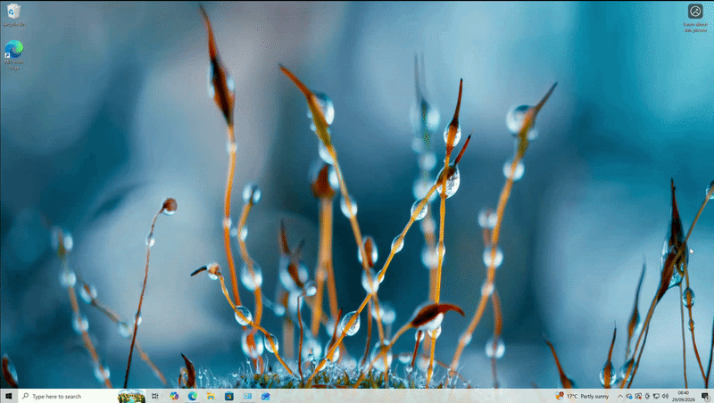

# Installation

## Windows

Visit our [release page](https://github.com/FELIXroboticsBV/FELIX-FILO/releases) and select the release you would like to install.

Navigate to the very bottom of the release page and unroll the `Assets` collapsible menu.

From here select either `FELIX-Filo-installer.exe` or `.msi`. We **recommend** the `.msi` installer.

<figure markdown="span">
  { width="600" }
  
<figcaption>Finding linux installable</figcaption>
</figure>

From here select either `FELIX-Filo-installer.exe` or `.msi`. We **recommend** the `.msi` installer.

<figure markdown="span">
  { width="600" }
  
<figcaption>Downloading the windows installers </figcaption>
</figure>

Once you select installable you would like to use, it will start to download.

!!! danger "Attention"

    Windows might warn you about this program being unsecure, in which case verify that you are downloading from our github repository. If you are sure that is the case, you can tell windows that you trust this publisher. If it is not the case, please contact our suppot [support@felixprinters.com](mailto:support@felixprinters.com?cc=spk@felixrobotics.com)

### Proceeding with the installer

Double click on the installer you have just downloaded and follow the the instructions.

The installation wizard will welcome you. Click `Next` to proceed.

<figure markdown="span">
  { width="600" }
  
<figcaption>Proceeding with the installer</figcaption>
</figure>

As a next step it is required that your agreee with our terms and conditions as well as GNU license.

You can read the license directly in the installer. If you agree check the little box on the left of the screen labeled "I accept the terms in the license agreement".

<figure markdown="span">
  { width="600" }
  
<figcaption>Accepting the license</figcaption>
</figure>

Once license is accepted we can proceed further.

### Installation configuration

Next the installer will ask you what features to install. We recommend going with the `Typical` option.

However if you wold like the application to be able to interpret `.gltf` files or provide URL protocols select `Custom`.

In case you would like to install everything the application has to offer simply select `Complete`

<figure markdown="span">
  { width="600" }
  
<figcaption>Choosing the application configuration</figcaption>
</figure>

### Finishing up

Next press `Install` to proceed with the installation.

This will show you a progress bar indicating how much of the application is installed.

!!! warning "Important"

    Windows will ask , if you trust the publisher of the application. You have to select `Yes` as shown on the gif below.

<figure markdown="span">
  { width="600" }
  
<figcaption>Finishing the the installation and giving application write permission so that it can install itself</figcaption>
</figure>

Now you have to wait until the application is done installing.

As a last step is to press `Finish` on the installation.

### Finding the application

Simply navigate to the windows search bar and type `FELIX`. The application should show up in the results window. To launch it click on it.

<figure markdown="span">
  { width="600" }
  
<figcaption>Searching for FELIX will find the application</figcaption>
</figure>

Feel free to create a desktop shortcut out of it.

Now visit [Getting started](../Getting%20Started/Getting%20started.md) for how to navigate the welcome window.

## Linux

### Downloading the `.AppImage`

Visit our [release page](https://github.com/FELIXroboticsBV/FELIX-FILO/releases) and select the release you would like to install.

Navigate to the very bottom of the release page and unroll the `Assets` collapsible menu

<figure markdown="span">
  { width="600" }
  
<figcaption>Finding linux installable</figcaption>
</figure>

By clicking on the `FELIX-Filo.AppImage` this will start to download the `.AppImage` installer.

### Running the installer

!!! note

    following steps will be done in the terminal, for the linux this is the most simple way of installing the application

Open terminal of your choice and navigate to were the `.AppImage` file was downloaded.

```sh
cd ~/Downloads
```

Make the installer executable

```sh
chmod +x FELIX-Filo.AppImage
```

Run the installer

```sh
./FELIX-Filo.AppImage
```

This will install your application as well as create desktop shortcut. After this you can freely use the application.

Now visit [Getting started](../Getting%20Started/Getting%20started.md) for how to navigate the welcome window.

---

# FAQ

??? question "Which installer should I choose on Windows — .exe or .msi?"

    We recommend the `.msi` installer. Both work, but `.msi` is our preferred format for Windows installations.

??? question "Windows says this program is unsafe or from an unrecognized publisher. What should I do?"

    First verify that you downloaded the installer from our official GitHub repository. If you confirm the source is correct, you can tell Windows you trust the publisher and continue. If you did not download it from our GitHub repository, do not proceed — contact support at [support@felixprinters.com](mailto:support@felixprinters.com?cc=spk@felixrobotics.com).

??? question "Which installation type should I pick — Typical, Custom, or Complete?"

    `Typical` is recommended for most users. Choose `Custom` if you need the application to interpret `.gltf` files or provide URL protocols. Choose `Complete` if you want every feature the application offers installed.

??? question "During installation, Windows asks if I trust the publisher. Should I allow it?"

    Yes — select `Yes` when prompted. This permission is required so the application can install itself properly.

??? question "I finished the installer, but where do I find the application afterward?"

    Open the Windows search bar and type `FELIX`. The application will appear in the results — click it to launch. You can also create a desktop shortcut for easier access afterward.

??? question "On Linux, the AppImage won't run when I try to launch it. What am I missing?"

    Make sure you've made the file executable first by running `chmod +x FELIX-Filo.AppImage` in the terminal from the directory where it was downloaded, then run it with `./FELIX-Filo.AppImage`.

??? question "Does the Linux AppImage create a desktop shortcut automatically?"

    Yes — running the AppImage installs the application and creates a desktop shortcut automatically, so you won't need to repeat the terminal steps afterward.
