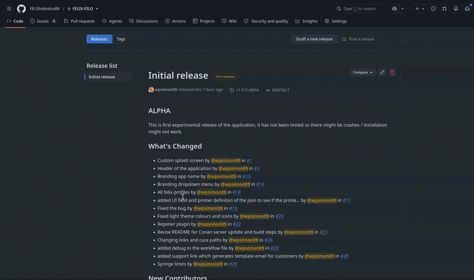

# Installatie

## Windows

## Linux

### Het `.AppImage`-bestand downloaden

Ga naar onze [releasepagina](https://github.com/FELIXroboticsBV/FELIX-FILO/releases) en selecteer de release die u wilt installeren.

Navigeer naar de onderkant van de releasepagina en klap het uitklapmenu `Assets` open.

<figure markdown="span">
  { width="600" }
<figcaption>Linux-installatiebestand vinden</figcaption>
</figure>

Door op `FELIX-Filo.AppImage` te klikken, start de download van het `.AppImage`-installatieprogramma.

### Het installatieprogramma uitvoeren

!!! note

    De volgende stappen worden uitgevoerd in de terminal; voor Linux is dit de eenvoudigste manier om de applicatie te installeren.

Open een terminal naar keuze en navigeer naar de locatie waar het `.AppImage`-bestand is gedownload.

```sh
cd ~/Downloads
```

Maak het installatiebestand uitvoerbaar

```sh
chmod +x FELIX-Filo.AppImage
```

Voer het installatieprogramma uit

```sh
./FELIX-Filo.AppImage
```

Hierdoor wordt de applicatie geïnstalleerd en wordt er ook een snelkoppeling op het bureaublad aangemaakt. Daarna kunt u de applicatie vrij gebruiken.

Bezoek nu [Aan de slag](../Getting%20Started/Getting%20started.nl.md) om te zien hoe u door het welkomstvenster navigeert.
