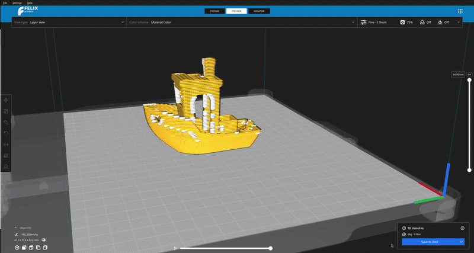

# Uw G-code exporteren

Zodra u tevreden bent met hoe het model is gesliced, kunt u de G-code printinstructies exporteren rechtsonder in de applicatie.

!!! note

    Om de exportoptie beschikbaar te hebben, moet u aan twee voorwaarden voldoen

    - uw model moet gesliced zijn
    - u moet zich in de voorbeeldmodus van de applicatie bevinden

Bij het exporteren naar de schijf opent de applicatie een bestandsverkenner die native is aan uw besturingssysteem, waar u een locatie op uw computer kunt selecteren waar de G-code wordt geëxporteerd.

<figure markdown="span">
  { width="900" }
<figcaption>Een map selecteren waar de applicatie de gcode zal exporteren. G-code-bestanden worden opgeslagen met de extensie .gcode<figcaption>
</figure>
