# External connection to the printer

Application supports connection to the printer. Which mens you can use this application to send sliced g-code directly to the printer and start printing.Just like you normally would, with classical 2D printers and documents.

To start the connection process you have to open the printer menu in the top left side of the window.

## What is Repetier

Repetier is a program that lets you control your 3D printer from your computer. This means you can start prints, watch progress, and adjust settings like temperature in real time.

This is why we are using it, it comes preinstalled on all of our 3D printers so, as long as the printer is connected to the internet you should be able to connect to it through this application.

!!! Warning

    It is very ,very important that both the computer you are connecting from and the printer itself are connected to the same network. In other words both need to be connected to the same wifi / router.

## Establishing connection

<figure markdown="span">
  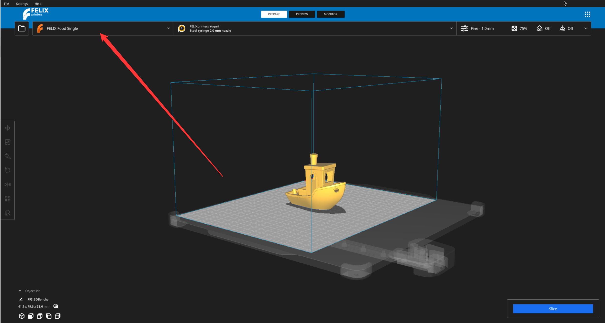{ width="900" }
<figcaption>Click on the printer menu on the top left of the application. <figcaption>
</figure>

Then select `Manage printers`

<figure markdown="span">
  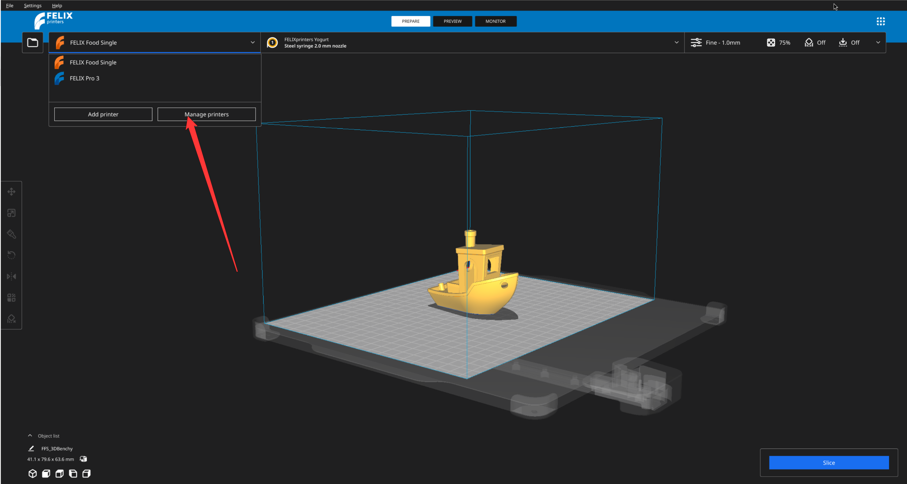{ width="900" }
<figcaption>Select manage printers option <figcaption>
</figure>

You will see a window with various settings. And more importatly all of the printers you have imported into the application.

<figure markdown="span">
  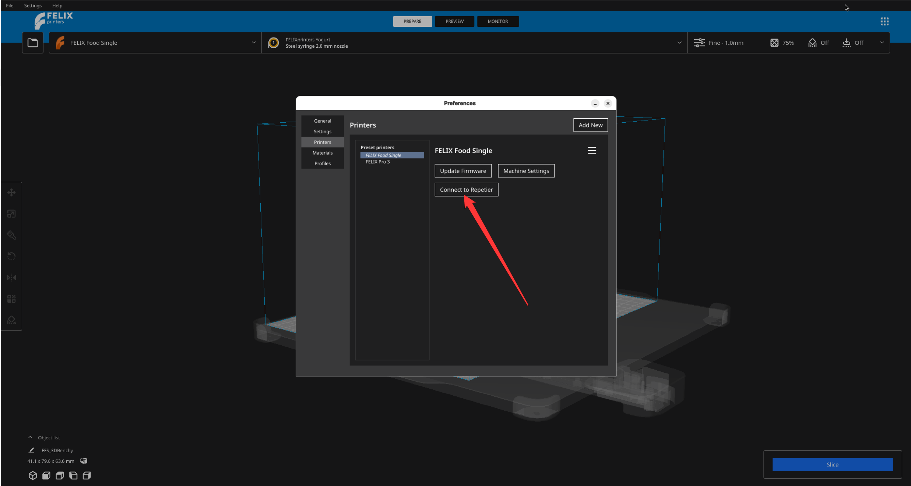{ width="900" }
<figcaption>Pop -up with all the options for the printers <figcaption>
</figure>

!!! warning

    You will see this option only on the printer that is currently configured as a primary. That is you see it on the top left of the view port menu directly on right from the small folder button

In this pop-up click `Connect repetier`. That will open another pop-up which will show you and overview of all the connections that are establishes. As a next step click `Add`.

<figure markdown="span">
  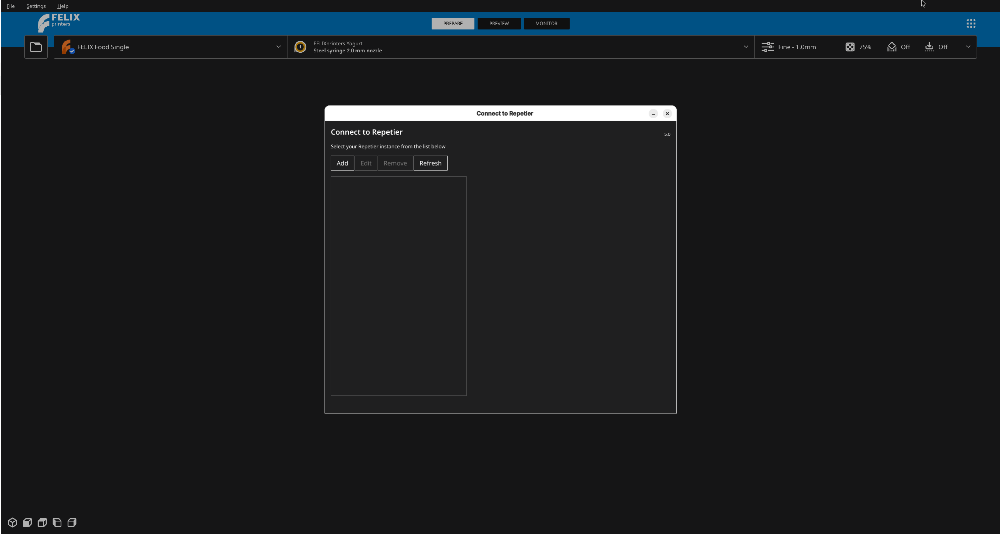{ width="900" }
<figcaption>Select manage printers option <figcaption>
</figure>

What follows is a quite confusing and intimidating pop-up. So we will go slowly through it.

<figure markdown="span">
  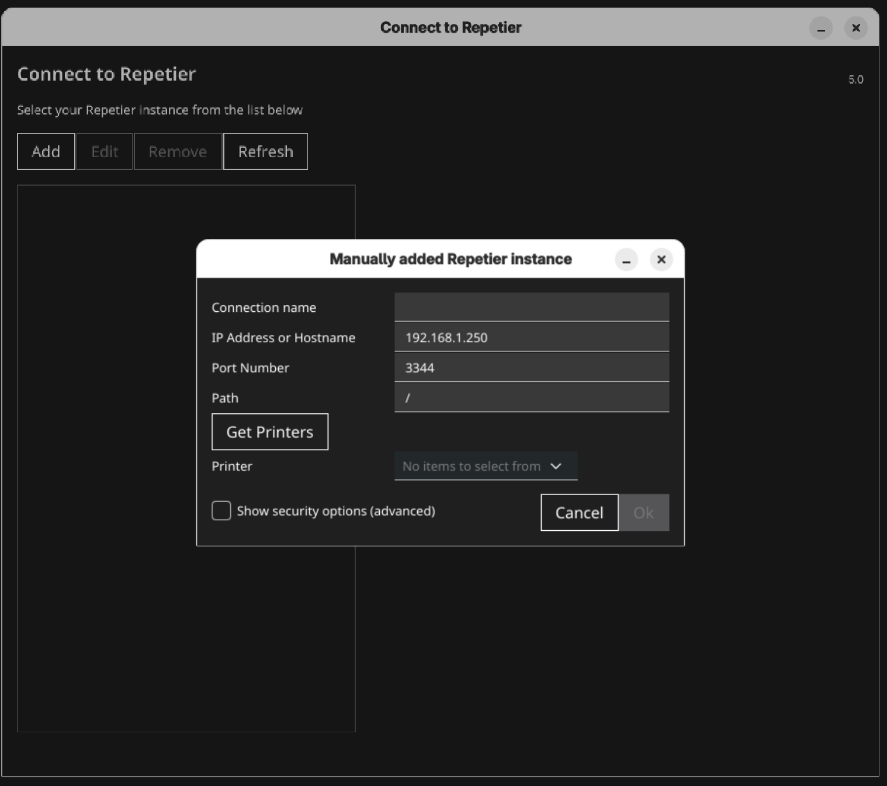{ width="900" }
<figcaption>Select manage printers option <figcaption>
</figure>

### Filling in the details

**Connection name**

Is the name you want to give to this connection. It does not matter what name you choose.

---

**IP address or host name**

Under which IP address is your printer discoverable on the current network ?

Fill in the IP that shows on your printer`s network tab

---

**Port**

Since there can be many devices connected to the printer we need to distinguish between them, that is the port number.

This should be `3344` but check it on the Network tab of your printer GUI.

---

**Path**

Leave it at its defaulat.

---

**Show security settings**

We don`t need that.

---

### Looking for the printers

If everything is filled in press the button on the left that says `Get printers`. If nothing happens press it again in couple of seconds.

This will check if any printers are available on the server we have provided.

If all was successful you should see a name of the printer appear in the small combo box on the right of the `Get printers` button. Then press  `Ok`.

<figure markdown="span">
  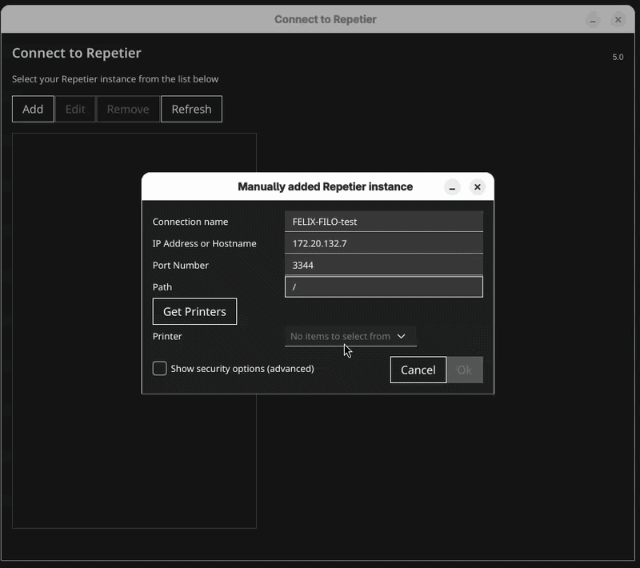{ width="900" }
<figcaption>Getting the printers<figcaption>
</figure>

### Getting the API key.

Now your printer should be added in the left list.

<figure markdown="span">
  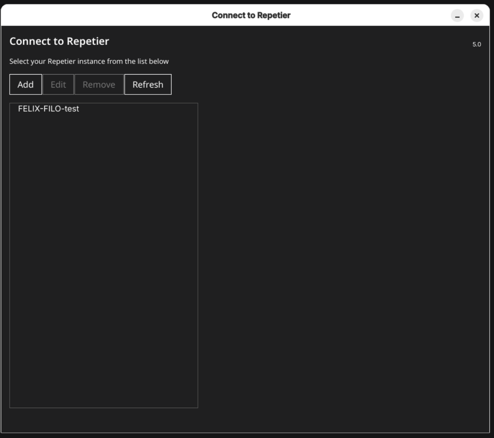{ width="900" }
<figcaption>Establishing connection with the repetier server <figcaption>
</figure>

Next step is to retrieve the API key from the repetier server.

To do that click on the printer you have just added in the left list and on the bottom part of the pop-up there should be button saying `Open in browser...`. Click it.

<figure markdown="span">
  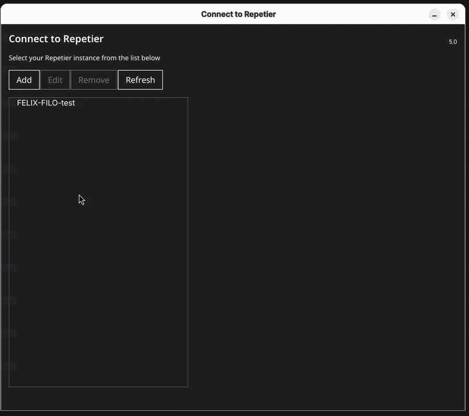{ width="900" }
<figcaption>Opening repetier in browser <figcaption>
</figure>

!!! NOTE

    Video shows the API key already filled in that is because application remember`s it however you should not have anything filled in there. If you do, follow the steps below regardless

You will be redirected to the website of the repetier server. It is unfortunately out of scope to talk about it in more depth so feel free to read more on [this page](https://www.repetier-server.com/manuals/1.4/index.html).

Now to retrieve the API key click on the cogwheel icon on the top right of the page and select `Global settings`

<figure markdown="span">
  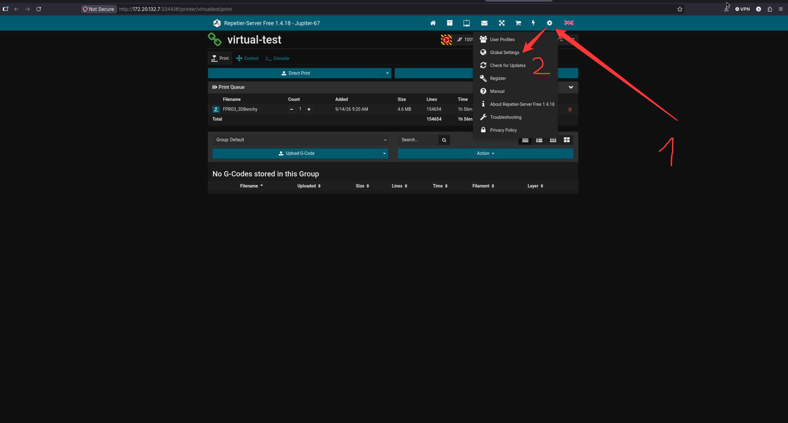{ width="900" }
<figcaption>Opening the global settings <figcaption>
</figure>

The API key can be found under the **Connectivity** section in the paragraph labeled API Key.

For convenience use the little blue button right of the API key to copy it to your clip board. Or you can highlight the API key and press `CTRL+C`

<figure markdown="span">
  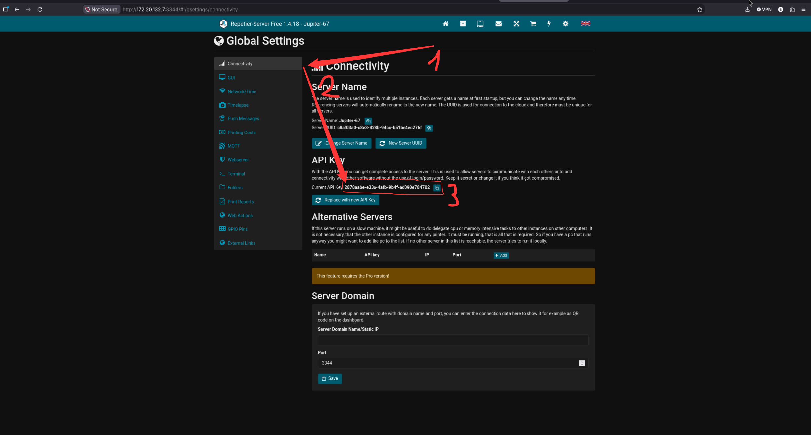{ width="900" }
<figcaption>Finding API key under Connectivity -> API key <figcaption>
</figure>

Now you can come back and paste the API key you have just obtained into the input field labeled `API Key`.

Once the API key is there `Connect to printer` button should not longer be grayed out and you can click it. If all went well, on the bottom of the screen you should see pop-up saying the connection was established.

<figure markdown="span">
  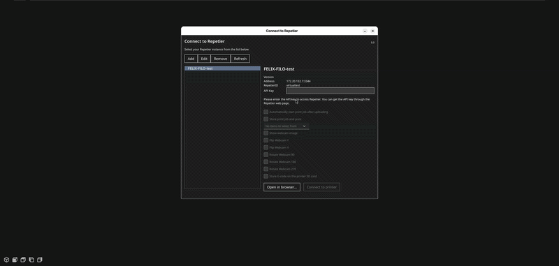{ width="900" }
<figcaption>Establish connection by pressing connect  <figcaption>
</figure>

After this step you can close both pop-ups and continue with your work.

To see if a printer is connected at any time you can check the printer status in the top left corner. If printer is connected you can see a little blue circle next to the icon of the printer.

<figure markdown="span">
  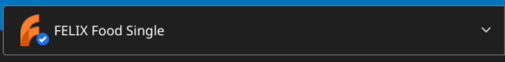{ width="700" }
</figure>

---

### FAQ

??? question "I don't see the 'Connect Repetier' option in the printer settings"

    This option only appears on the printer that is currently set as primary — the one shown on the top left of the viewport menu, right next to the small folder button. Make sure the correct printer is selected as primary first. If it still doesn't show up, this could be an uncommon issue — send a bug report through the menu in the top right corner of the application.

??? question "I can't connect to my printer even though I filled in the IP address and port"

    Double-check that both your computer and the printer are connected to the **same network** (same WiFi/router). Also verify the IP address and port number match exactly what's shown on your printer's Network tab. If everything matches and it still fails, this may not be a common issue — please send a bug report via the top right menu.

??? question "Clicking 'Get printers' does nothing"

    Wait a couple of seconds and press it again — sometimes the server takes a moment to respond. If repeated attempts don't return any printers, this is likely not a common issue, so send a bug report through the top right menu of the application.

??? question "No printer name appears in the combo box after searching"

    This usually means the connection details (IP, port) are incorrect, or the printer isn't reachable on the network. Re-check the details on your printer's Network tab. If the details are correct and the printer still doesn't appear, report this as a bug through the top right menu.

??? question "The 'Connect to printer' button stays grayed out"

    This means the API key field is empty. Make sure you've copied the API key from the Repetier server's Global Settings under **Connectivity** and pasted it into the API Key field. If the button remains grayed out even after pasting a valid key, this is likely not a common issue — please send a bug report via the top right menu.

??? question "I don't see a confirmation pop-up after clicking Connect to printer"

    Normally a pop-up appears at the bottom of the screen confirming the connection. If nothing appears, wait a few seconds and check the printer status icon in the top left corner. If there's no blue circle next to the printer icon and no error either, this is uncommon — send a bug report through the top right menu.

??? question "The printer status icon doesn't show a blue circle even though I completed all the steps"

    A blue circle next to the printer icon means it's connected. If it's missing after following every step correctly, try repeating the connection process from **Manage Printers**. If it still doesn't work, this is likely not a common issue — send a bug report via the top right menu.

??? question "I already have an API key filled in, but I never entered one myself"

    This is expected — the application remembers previously used API keys. Follow the same steps as usual to retrieve and re-enter the correct key regardless. If this causes unexpected behavior, report it as a bug through the top right menu.

??? question "What should I do if none of the troubleshooting steps solve my connection issue?"

    If your issue isn't covered by common fixes, please send a bug report through the menu in the top right corner of the application so it can be investigated further.
