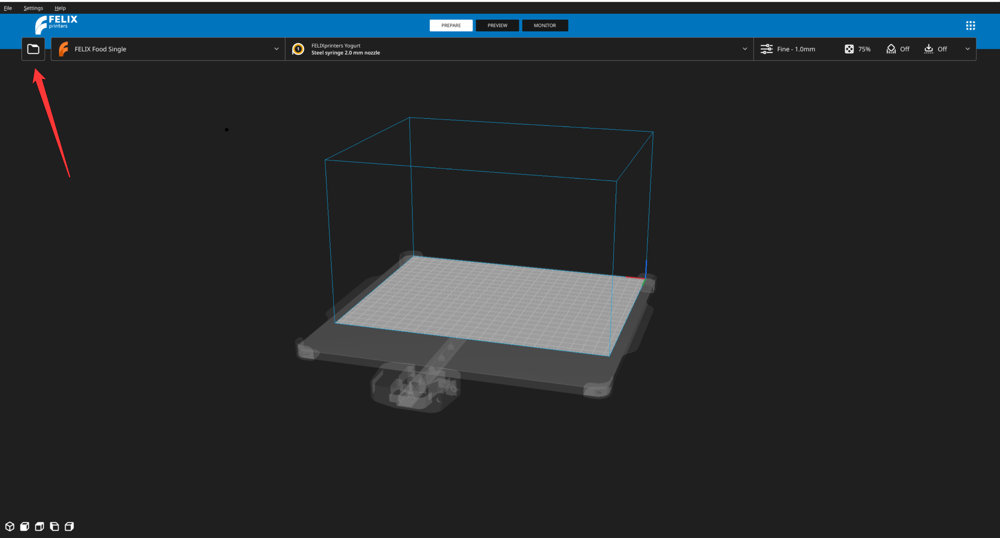
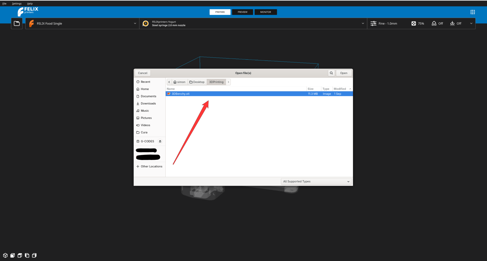
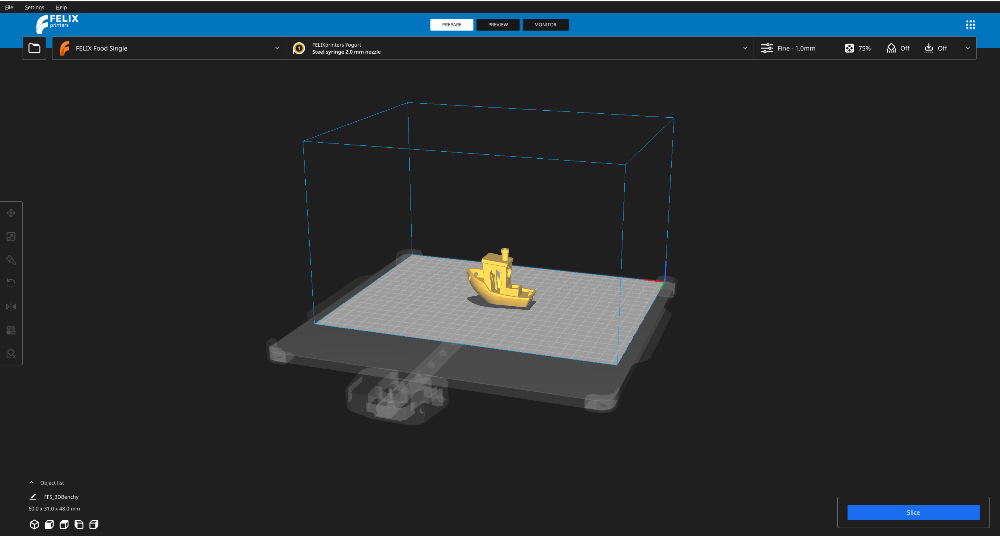
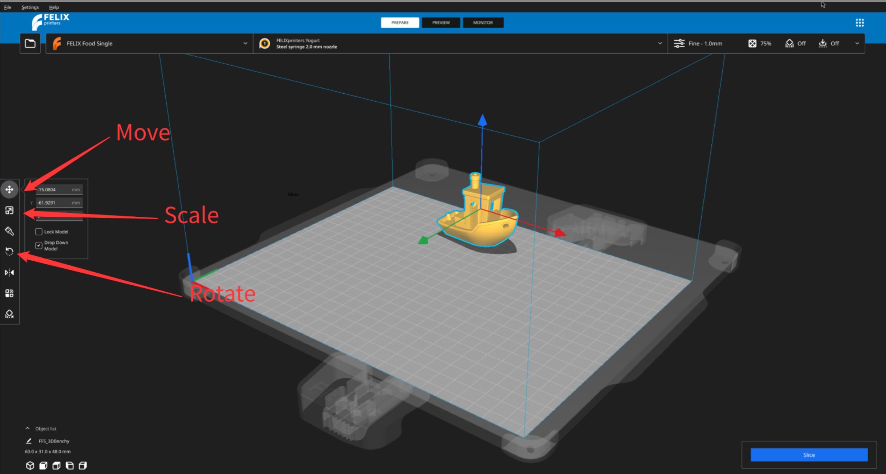
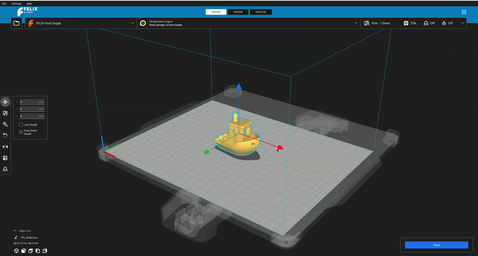
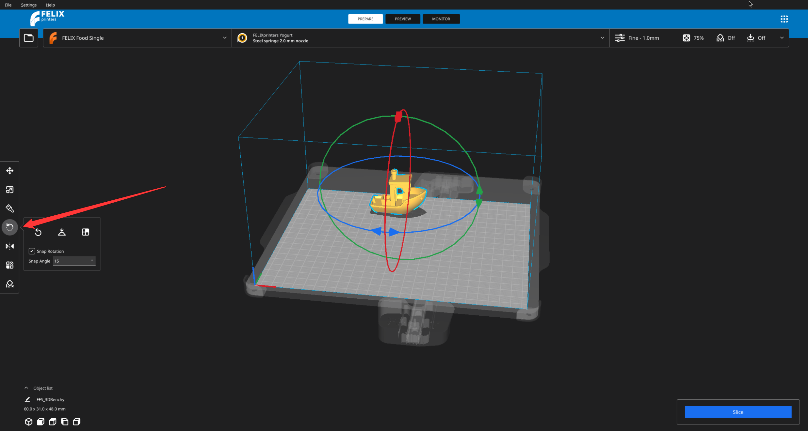
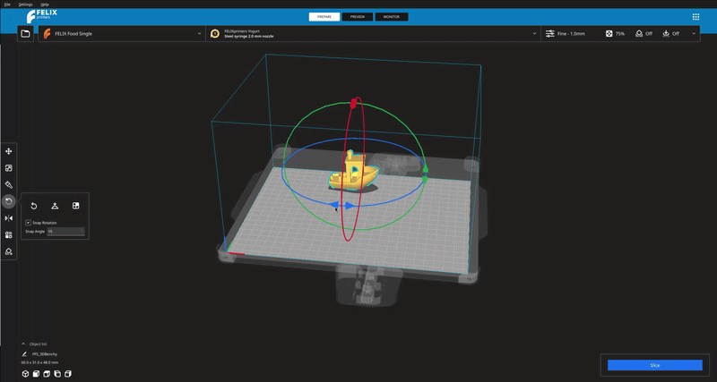
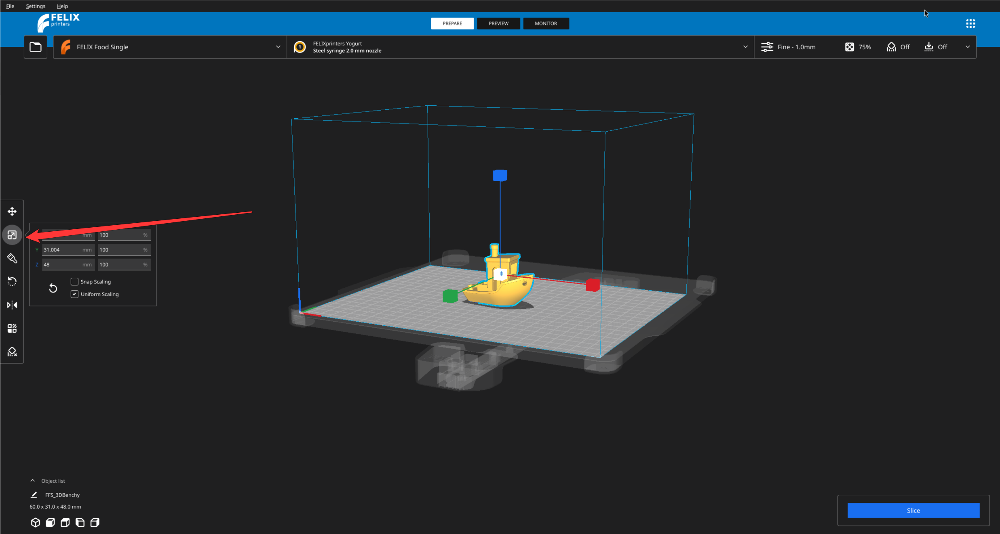
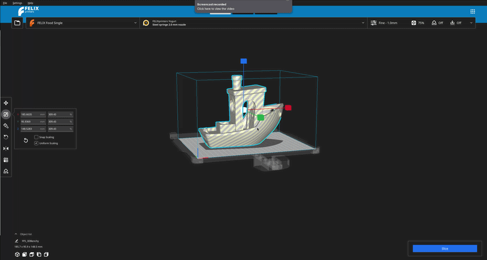

# Preparing the model

This page will guide you through the printing process and how you can convert your 3D model into the instructions that the printer can understand as follow.

This process i called slicing and those instructions are called `G-Code`.

## Importing a model

As a first that is required is that you have your 3D model you want to print. This 3D model can be created in 3D modeling softwares such as [Belender](https://www.blender.org/), [Maya](https://www.autodesk.com/products/maya/overview) or [AutoCad](https://www.autodesk.com/eu/products/autocad/overview).

To import your model you have to first find it in your computer. This can be done by pressing on the folder icon in the top left part of your screen. Right next to the printer`s name.

<figure markdown="span">
  { width="600" }
  
<figcaption>Open file explorer</figcaption>
</figure>

This will open a file browser native to your operating system. Use it to navigate to the folder where you model is stored. Double click on the file or select `Open` option in your file browser.

!!! Note

    It is recommended to use `.stl` models as they are most suited for slicing process and thus 3D printing. You can also use alternatives like `.gltf` or  `.fbx` but quality might vary.

<figure markdown="span">
  { width="600" }
  
<figcaption>Import file</figcaption>
</figure>

Application will then process your request and import it into the editor.

<figure markdown="span">
  { width="600" }
  
<figcaption>Import file</figcaption>
</figure>

## Positioning model

It might happen that the model you have imported appears outside of the Printing mat. You can easily adjust the position, rotation and scale of the model through the embedded controls in the application.

!!! Danger

    Remember that how you see your model on the printing mat is how it is going to be printed ! Therefore ensuring proper orientation and position of the model is important

To enter the positioning mode use your mouse to hoer the cursor over the model and press **Left** mouse button. This will highlight the edges of the model and shows you 3 arrows.

Those arrows can be used to position the model on the printing mat.

!!! Tip

    Those arrows have a name, from now on we will refer to them as a `translation gizmo` or just `gizmo`

You can control the operation that the gizmos preform by choosing one from the left panel which have appeared your screen.

<figure markdown="span">
  { width="600" }
  
<figcaption>Using your mouse to position the model on the printing mat </figcaption>
</figure>

The operations are in the following order

- position
- scale
- rotation

We will look into how each should be used.

!!! Note

    There are also other operations, but here we are going to focuse on the most basic ones. You can free to explore other operations on your own.
    TODO: write a page about other operations and redirect users there

### Changing position of the model

In order to change the position of the model use your mouse to hover over the arrow pointing into the direction you want your model to move, **hold** your **left** mouse button and drag your mouse along the arrow.

<figure markdown="span">
  { width="600" }
  
<figcaption>Different control options in the application </figcaption>
</figure>

### Changing the rotation of the model

To change the rotation of the model select hte rotation operation form the left bar

<figure markdown="span">
  { width="600" }
  
<figcaption>Using your mouse you can controll the rotation of hte model along the 3 axes (X , Y, Z) </figcaption>
</figure>

Similarly to how you preformed positioning you can preform the rotation. That is however your mouse cursor over the gizmo you which to manipulate,  **hold** your **left** mouse button and drag the mouse into the direction your model should move.

<figure markdown="span">
  { width="600" }
  
<figcaption>Demonstration of how model can be rotation</figcaption>
</figure>

### Changing the scale of the model

If you want to make your model bigger / smaller you can od so by using scale operation.

Use your left bar to select scaling operation.

<figure markdown="span">
  { width="600" }
  
<figcaption>Using your mouse you can controll the rotation of hte model along the 3 axes (X , Y, Z) </figcaption>
</figure>

Scaling is bit different than the previous operations becase most of the time you want the model to scale uniformly across 3 axes. Scaling it in only one axis might deform the model. But you are free do so.

In order to scale the model uniformly you want to manipulate white cube from which all other axes originate from.

<figure markdown="span">
  { width="600" }
<figcaption>Use your mouse to select the center white cube and drag it. If you drag along negative Y axis (down) the model will scale down if you drag it along positive Y axes (up) the model will scale up <figcaption>
</figure>

### FAQ

??? question "I can not move my model"

    Most likely your model got unselected along the process. Click on the model to select it again

??? question "My model has tiger pattern"

    Your model is too big, use scaling operation to make it smaller

??? question "My model is outside of the printing mat"

    Use arrows to move it within the printing mat.

??? question "I positioned my model where i do not want it to be "

    No problem use `Ctrl` + `Z` to execute Undo action which will revert your changes. In case you want to undo the revert use `Ctrl` + `Y`
