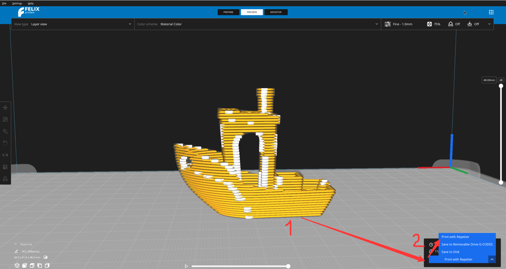
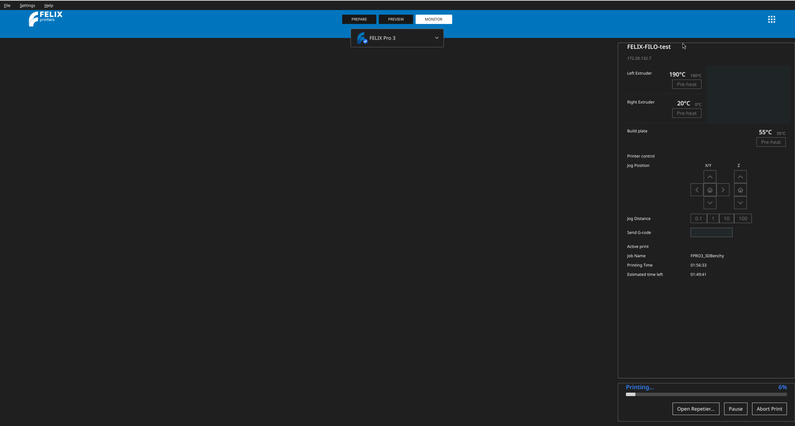

# Printing from the application

## Prerequisites

In order to accomplish steps in this part of the documentation you first need to take care of few other things:

- [know how to slice the model](./Slicing.md)
- [connection to the Repetier serer](./External%20connection%20to%20the%20printer.md)

## Sending print files to the repetier

Once your model is ready to be printed, navigate into the **Preview menu**

<figure markdown="span">
  { width="600" }
  
<figcaption>Preview mode is located on the top menu in the middle.</figcaption>
</figure>

And in the bottom right button through which you would normally export the g-code to your computer select an option `Print with repetier`

<figure markdown="span">
  { width="600" }
  
<figcaption>Select print with repetier from the options where you can select how to print.</figcaption>
</figure>

When clicked the model will be send to the queue for printing. If the queue is empty it will start the print right away.

## Monitoring the print

Once the print is send to the repetier you will be redirected to the
 `Monitor` tab. Here you can see progress of the print. If your 3D printer has a camera then you will also see a live preview from this camera.

You can pause or stop the print directly from the application.

<figure markdown="span">
  { width="600" }
  
<figcaption>Notice progress bar on the bottom as well as the actions to stop / pause the print</figcaption>
</figure>

---

### FAQ

??? question "I don't see the 'Print with Repetier' option in the export menu"

    Make sure you are in **Preview mode** and that your model has already been sliced. Also confirm your printer is connected to Repetier — see [External connection to the printer](./External%20connection%20to%20the%20printer.md). If the option still doesn't appear, send a bug report through the top right menu of the application.

??? question "My print doesn't start after clicking 'Print with Repetier'"

    If the print queue is not empty, your job will wait until the current print finishes. Check the **Monitor** tab to see the queue status. If the queue is empty and the print still doesn't start, this may not be a common issue — send a bug report via the top right menu.

??? question "I'm not redirected to the Monitor tab after sending the print"

    This should happen automatically once the print job is sent. Try navigating to the Monitor tab manually. If it's not showing any progress or information, this is likely not a common issue — please send a bug report through the top right menu.

??? question "I don't see a live camera preview in the Monitor tab"

    A live preview only appears if your 3D printer has a camera connected and configured. If your printer does have a camera and the preview still isn't showing, send a bug report through the top right menu of the application.

??? question "The pause or stop buttons aren't working"

    Check your connection status to the printer in the top left corner — a blue circle next to the printer icon means it's connected. If the connection looks fine but pause/stop still doesn't respond, this is likely not a common issue — report it as a bug through the top right menu.

??? question "The progress bar isn't updating during my print"

    This can sometimes be a temporary sync delay between the application and the Repetier server. Wait a moment to see if it updates. If the progress bar remains frozen, send a bug report through the top right menu.

??? question "Can I close the application while the print is running?"

    The print itself runs on the Repetier server, but we recommend keeping the application open to monitor progress, pause, or stop the print if needed. If you experience unexpected behavior after reopening the application, report it as a bug through the top right menu.
