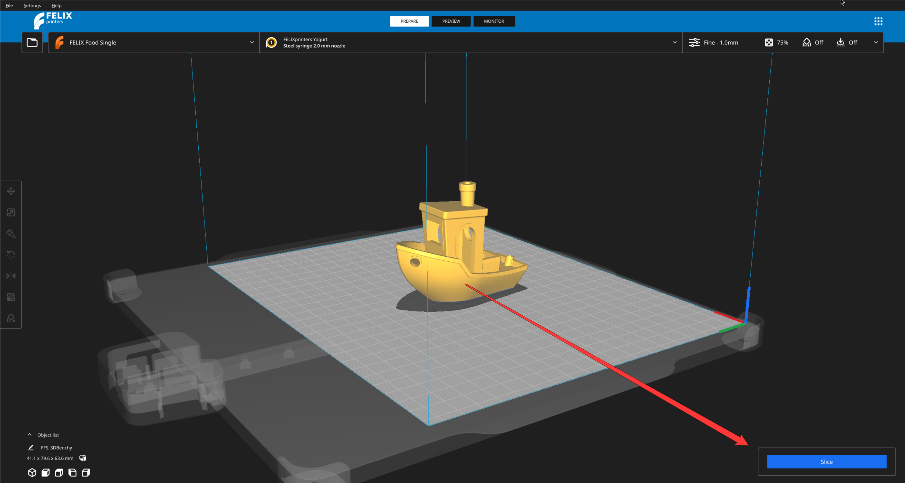
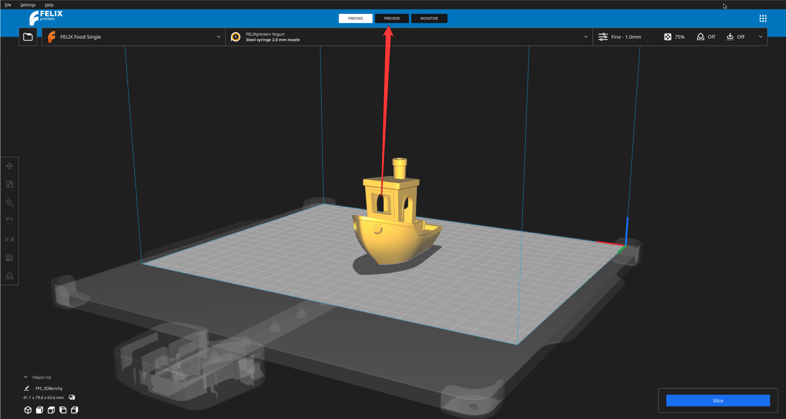

# Slicing

Once you are happy with how your model is positioned we can continue to the next step, which is slicing.

Slicing is an procedure that takes the model and converts it into the instructions that your 3D printer can understand and execute. Those instructions are simple commands such as

- move 30 mm along the x axis
- move 20 mm along the y axis and deposit 0.2 mm of fillament

To slice the model all you have to do is press slice on the bottom right screen of the window.

<figure markdown="span">
  { width="600" }
  
<figcaption>Slicing button on the bottom right</figcaption>
</figure>

Depending on how powerful your computer is or how big/detailed is your model this process might take some time. In extreme cases we are talking hours.

!!! success

    Application will not allow you with slicing if there is something horribly wrong with your model. This will prevent any harmful prints being executed on the printer.

!!! tip

    If you want to slice again, simply the move the model by a bit which will force the application reslice model.

## Preview

Once the slicing has completed you can preview the G-code which was generated by the slicer.

To do this you have to switch a mode in which the application is currently in. Changing modes is done by selecting the buttons in the middle of your screen on the very top.

<figure markdown="span">
  { width="600" }
  
<figcaption>Preview mode is located on the top menu in the middle.</figcaption>
</figure>
