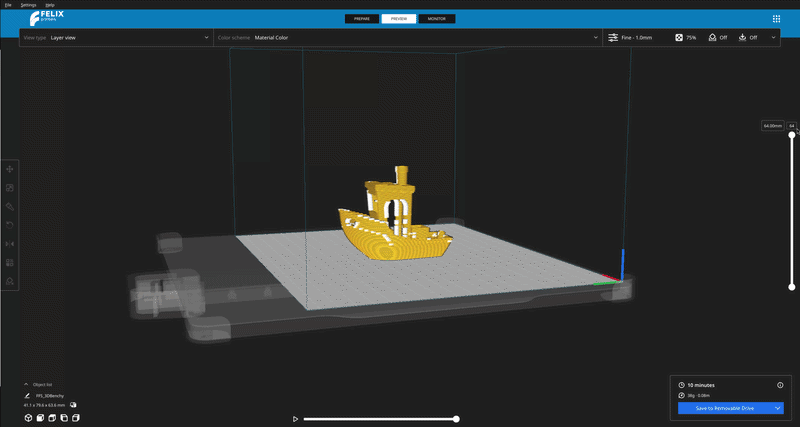
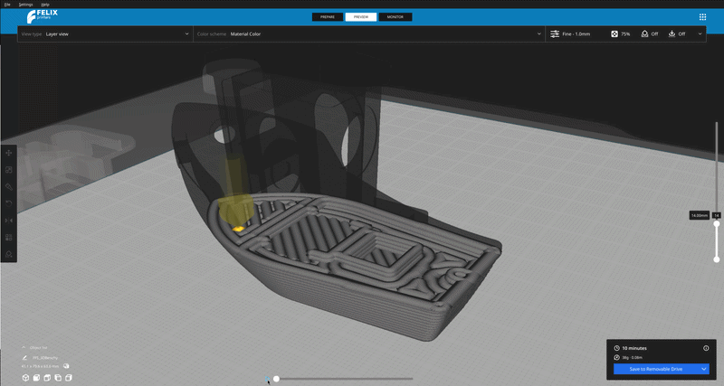

# Slicing

Once you are happy with how your model is positioned we can continue to the next step, which is slicing.

Slicing is an procedure that takes the model and converts it into the instructions that your 3D printer can understand and execute. Those instructions are simple commands such as

- move 30 mm along the x axis
- move 20 mm along the y axis and deposit 0.2 mm of fillament

To slice the model all you have to do is press slice on the bottom right screen of the window.

<figure markdown="span">
  { width="600" }
  
<figcaption>Slicing button on the bottom right</figcaption>
</figure>

Depending on how powerful your computer is or how big/detailed is your model this process might take some time. In extreme cases we are talking hours.

!!! success

    Application will not allow you with slicing if there is something horribly wrong with your model. This will prevent any harmful prints being executed on the printer.

!!! tip

    If you want to slice again, simply the move the model by a bit which will force the application reslice model.

## Preview

Once the slicing has completed you can preview the G-code which was generated by the slicer.

To do this you have to switch a mode in which the application is currently in. Changing modes is done by selecting the buttons in the middle of your screen on the very top.

<figure markdown="span">
  { width="600" }
  
<figcaption>Preview mode is located on the top menu in the middle.</figcaption>
</figure>

In preview mode, the model remains present but is rendered as a set of lines which match of where the printer will go.

It is possible that you will see some foreign object appear on your model. This is nothing to wary about, this is a supporting structure which ensures that your 3D print does not collapse or brake. After th print is done the supporting structures are designed to be easily removable.

### Using the preiview

3D printers used for printing models / shapes operate on layers. Printer will not start to work on the layer until it is done with the previous. This can be visualized on the right slider of the preview mode. You can adjust it up or down depending how many layers shoudl be visible at the time.

!!! note

    Unlike in application printer always starts is job at the layer 0 and moves up in the layer stack.

<figure markdown="span">
  { width="600" }
  
<figcaption>Using slider on the right you can examine separate layers. </figcaption>
</figure>

You can also preview how the nozzle of the printer will move on this layer. This can be done by pressing with **left button** onto the little play button on the botton of the screen.

This will show you virtual nozzle which moves "deoposits" material. This way you can double check integrity of your prints if you are`t quite sure why is it failing.

<figure markdown="span">
  { width="600" }
  
<figcaption>Slider on the bottom represents how much work does printer still has to do before the selected layer is finished </figcaption>
</figure>

??? question "My model is falling through the build plate / floating above it"

    Use the **Drop to Buildplate** option (right-click the model → *Drop to Buildplate*) to automatically snap it flush with the plate.

??? question "My print has poor first layer adhesion"

    Try enabling a **Skirt** or **Brim** under *Build Plate Adhesion* settings. A Brim adds extra surface area around the base of your model, helping it stick better.

??? question "My model is too large for the build volume"

    Use the **Scale** tool (`S`) to resize your model, or right-click it and select *Scale to Max* if you want it to automatically fit the build plate.

??? question "I want to print multiple copies of the same model"

    Right-click the model and select **Multiply Model**, then enter the number of copies you want. FELIX-FILO will automatically arrange them on the build plate.

??? question "My overhangs are drooping or sagging"

    Enable **Support Structures** under the *Support* settings. You can also adjust the *Support Overhang Angle* to control when supports are generated.

??? question "I accidentally deleted a model from the build plate"

    Use `Ctrl` + `Z` to undo the deletion, just like any other action in FELIX-FILO.

??? question "My model isn't rotated the way I want"

    Use the **Rotate** tool (`R`) to manually adjust orientation, or right-click the model and choose *Reset Rotation* to return it to its default orientation.
